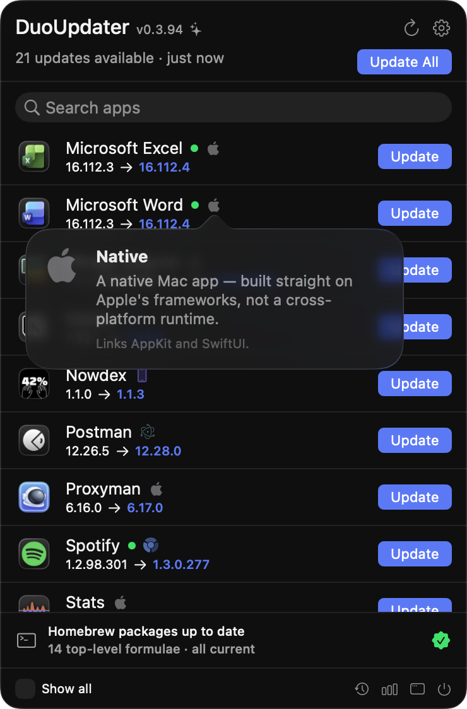
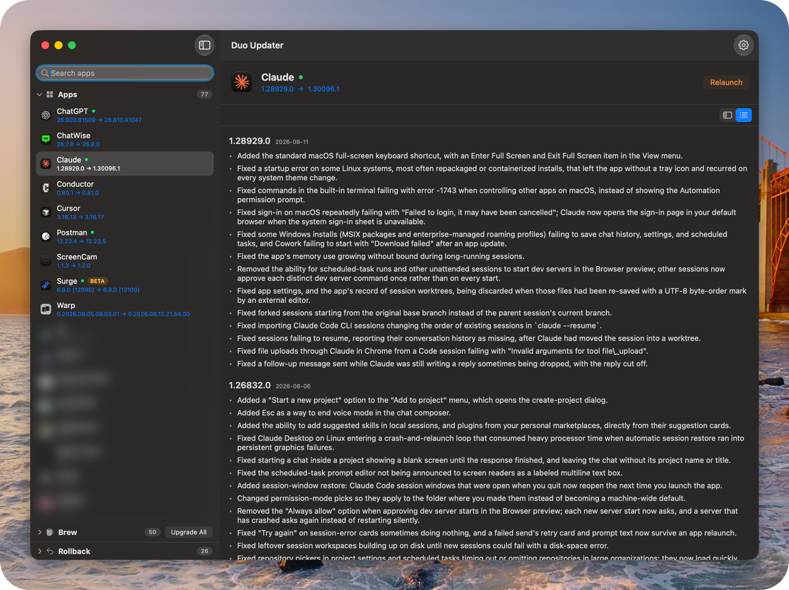
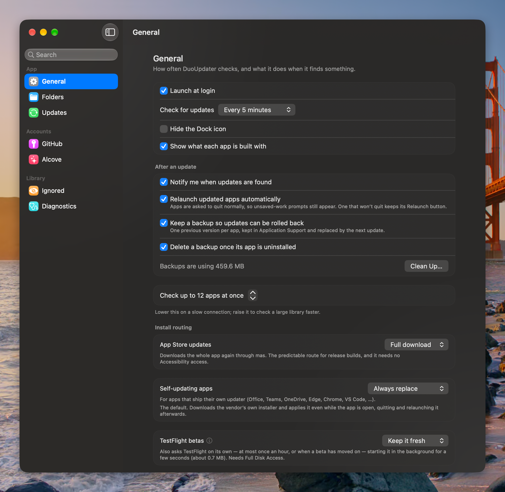
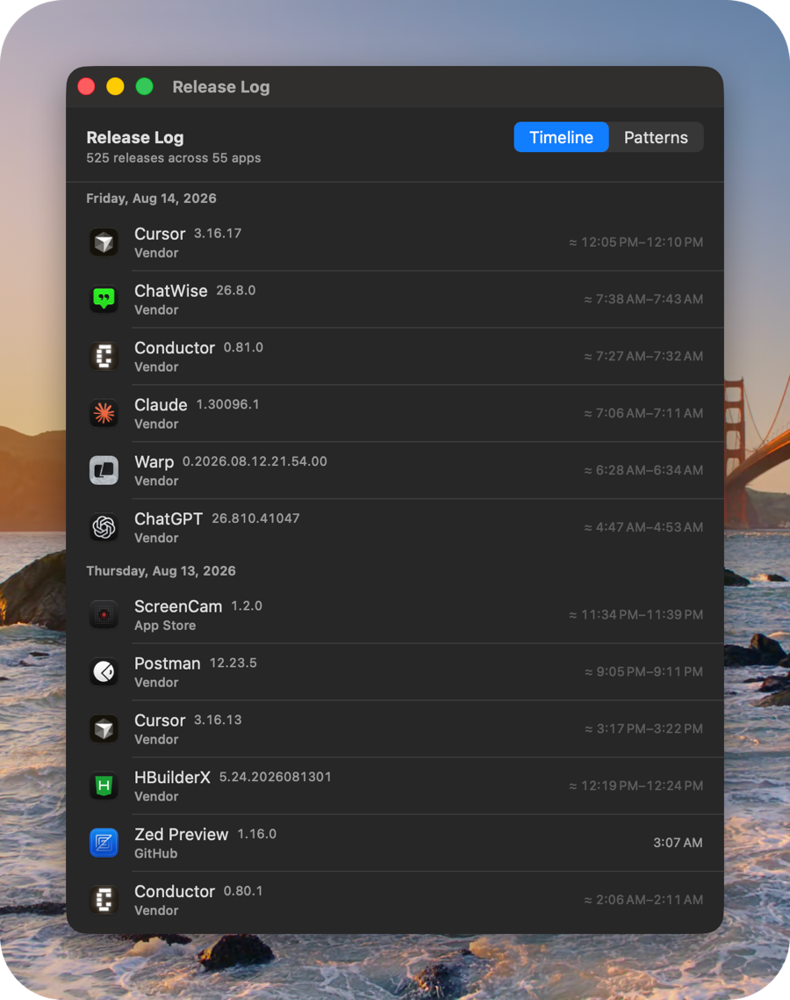
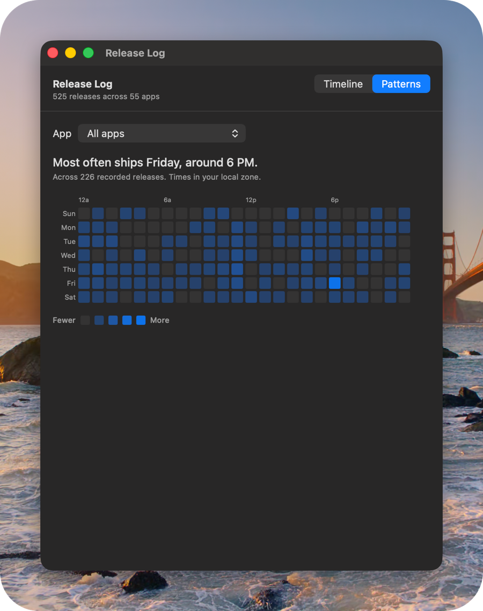

# Duo Updater

A macOS menu-bar app that finds updates for the apps you already have, and
installs them the way each app expects to be updated.

Most updaters pick one mechanism and push every app through it. This one reads
each app's own release channel — its Sparkle appcast, its App Store listing, its
Homebrew cask, its vendor's release feed — and uses that. When an app ships its
own updater, it hands over instead of fighting it; when it can't do something
safely, it says so rather than guessing. Pure Swift, no telemetry, no server.

<p align="center">
  
</p>

Each row says what you are going from and to, and the button says what will
actually happen: **Update** installs, **Relaunch** means it is already updated on
disk and only the running copy is stale. A green dot marks an app that is
running, so you know before you click whether something is about to be quit and
reopened, and a channel tag appears where an app is not on its default track —
the Surge row here is a beta, so it compares build numbers rather than the
marketing version they share.

The single row at the bottom is everything Homebrew installs that **isn't an
app**: command-line formulae, and casks that install no `.app` at all — a CLI, a
font, a driver. None of those need a per-app decision, and they have no bundle to
scan, so without that row they would be invisible entirely. A cask that *does*
install an app gets an ordinary row like anything else, and is never touched by
the upgrade here, so nothing is counted twice.

<p align="center">
  
</p>

Opening the window gives you everything it scanned, and the release notes for
whatever you select. Where a vendor publishes notes in a form worth parsing,
they are pulled apart and rendered as native text — version, date, one bullet per
change — instead of an embedded web page. Sparkle appcasts and GitHub releases
carry their notes inline; for the rest there is a per-app recipe, and vendors
whose page resists parsing fall back to the page itself in a `WKWebView`. Some
app names are blurred here; they are only this machine's library.

<p align="center">
  
</p>

Most of the settings are about how much autonomy you want to give it — whether
to restart apps for you, whether to keep a rollback backup, and how to route the
two awkward cases: Mac App Store apps, and apps that ship their own updater.

## How it works

Apps are scanned from `/Applications`, `/Applications/Utilities`, and
`~/Applications`, then checked against multiple update sources, in priority order:

1. **Mac App Store** — iTunes lookup API, with storefront/region awareness
   (only native `mac-software` results are trusted; iOS-on-Mac apps are skipped
   to avoid phantom updates).
2. **Sparkle** — the app's own `SUFeedURL` appcast.
3. **Homebrew Cask** — matched by `.app` filename, falling back to bundle id
   (so `pkg`-only casks like AweSun are still found).

It **respects each app's own update channel**:

| Channel | Action |
| --- | --- |
| Sparkle | Native install — download → EdDSA + code-signature + Team ID checks → swap → relaunch |
| Mac App Store | Open the store page (deep link); region-locked apps are flagged |
| Self-updating (Electron/Squirrel) | Open the app and let it update itself |
| Homebrew app cask | `brew install --cask --force` |
| Homebrew `pkg` cask | Download the official package and open the system installer |

## Install safety

- **Never force-quits** a running app. When an update needs the app restarted to
  take effect, the quit is a plain `terminate()` — the app runs its own save
  prompts and can refuse. One that refuses is left running and keeps a
  **Restart** button, so unsaved work is never at risk from a forced exit. Note
  the restart happens *after* the new version is on disk, so a refusal leaves an
  updated bundle beside a process still running the old code until you relaunch
  it yourself.
- **Major version upgrades** are gated behind a warning (a commercial app may
  need a new license) instead of a one-click button.
- **Defensive re-check** before installing, so a stale list never triggers a
  redundant install.
- **Restart detection**: if an app was updated on disk but is still running an
  older build (compared via LaunchServices), it's surfaced with a Restart action.

## Release Log

Every version it sees gets recorded, so over time you get a log of when the
software you use actually ships — and, in aggregate, when its developers tend to
release.

<p align="center">
  
  
</p>

The interesting part is what it refuses to claim. A release time is only exact
when the vendor's own feed timestamps it — Sparkle, GitHub and Alcove do. Every
other source tells us a version exists but not when it appeared, so all we
honestly know is that it happened between the last check that saw the old version
and the first that saw the new one. Those are shown as a window with a `≈`, and a
wide window is visibly low confidence rather than a precise-looking lie.

The heatmap then uses only the exact tier. That is why the window above says 525
releases while the pattern reads from 226: the other 299 are real releases whose
timing is an inference, and an inference has no business shaping a claim about
when somebody ships.

## How this compares to Latest

[MacUpdater](https://www.corecode.io/macupdater/) was discontinued on 1 January
2026 — for financial rather than technical reasons, per its author — which is why
this exists. The obvious open-source option is
[Latest](https://github.com/mangerlahn/latest), and it is a good app. The two
make opposite bets, so it is worth knowing which one you want.

**Latest delegates the install.** For Sparkle apps it runs `SPUUpdater` inside
its own process with the *target* app as the host bundle, acting as the user
driver and auto-answering the prompts; for App Store apps it drives Apple's
private CommerceKit. It never replaces a bundle itself. That is an elegant bet:
almost no trusted code of its own, and each install is performed by the machinery
that app already ships with. The cost is reach — Sparkle and the App Store are
the two paths it can take, its Homebrew support is detection-only (it opens the
app and lets that app update itself, and says so in the UI), and when Apple
changes a private framework the App Store path has to be rebuilt.

**This one owns the install.** It downloads, verifies and swaps the bundle
itself, which is what lets it also cover vendors that ship neither a Sparkle feed
nor an App Store listing — per-app recipes against a vendor's own endpoint,
GitHub releases, Homebrew casks, JetBrains Toolbox. Owning the install is what
makes the checks in [Install safety](#install-safety) possible: EdDSA where a
feed provides it, then a Developer ID signature, Team ID and bundle id that must
match the app being replaced, plus a backup you can roll back to. Latest inherits
whatever Sparkle and CommerceKit check and adds none of its own, and keeps no
backup.

The trade is maintenance. Per-app recipes break whenever a vendor rewrites a
download page, which is a real running cost — the same cost that a 100,000-app
database turned out not to be able to carry commercially. This project answers
that with a nightly sweep that re-checks every recipe against its live endpoint
and files an issue for each one that stopped working, and by covering a few dozen
apps properly rather than every app approximately.

Pick Latest if your apps are Sparkle and App Store apps and you would rather
trust less code. Pick this if you have apps neither of those reaches, or you want
the update chain to verify who signed the thing replacing your app.

## Privacy

There is no telemetry, no analytics SDK, and no server of ours. Every network
request goes straight to the vendor whose app is being checked (or to
`api.github.com` / `formulae.brew.sh`), and carries nothing about you beyond what
that request needs: the app's own version, so a vendor feed can answer for the
right channel.

Three things are worth calling out explicitly, because they involve reading
outside our own container:

- **CleanShot X** — if it is installed, its `activationKey` is read from its
  preferences and used to request the personalised appcast that its own updater
  uses. Without it, CleanShot's feed reports the trial channel. The key is sent
  only to `legit.maketheweb.io`, is never logged, and is excluded from the HTTP
  disk cache.
- **TablePlus** — its `IsReceiveBetaBuild` preference is read so we detect on the
  same channel the app itself is set to.
- **GitHub** — to raise the API rate limit from 60/hour to 5000/hour, a token is
  taken from `GITHUB_TOKEN`/`GH_TOKEN` or, failing that, from `gh auth token`.
  It is sent only to `api.github.com`, and is stripped from any redirect that
  leaves that host.

Credentials you enter yourself (a GitHub token, an Alcove licence) are stored in
the login Keychain as `AfterFirstUnlockThisDeviceOnly` — not synced, not in a
plist. Changelog panes render vendor pages in a `WKWebView` with a non-persistent
data store, so vendor cookies do not survive a relaunch.

## Permissions

macOS will ask for several of these, usually at the moment they are first needed
and without much explanation. Nothing here is required to *see* your apps — the
list, the version checks and the changelogs all work with everything denied. What
the permissions buy is stated plainly below, including what you lose by saying no.

**Full Disk Access** — the one worth granting up front.

The prompt reads *"DuoUpdater would like to access data from other apps"*, which
tells you nothing. What it actually covers is reading a handful of other apps'
own preferences and containers, because that is the only place some facts live:

- which release channel an app is set to — CleanShot, TablePlus, Fork, IINA,
  OrbStack, Tailscale. Denied, they are assumed to be on stable, so a beta
  install may be told it is out of date against the stable feed, or the other way
  around.
- whether an app came from TestFlight rather than the App Store. Denied, a
  TestFlight build can be mistaken for a release build.
- your App Store storefront, used to flag region-locked apps.

Denying it degrades those specific answers **silently** — the app still lists
everything and still installs updates. Grant it once in **System Settings →
Privacy & Security → Full Disk Access**; because the app is signed with a stable
identity, the grant survives every future update. Without it, the prompt returns
on every launch.

**App Management** — required to install anything. Replacing an app in
`/Applications` that some other installer put there is gated on this, and macOS
provides no API to ask for it in advance, so the first install triggers the
system prompt. Deny it and detection still works; installs fail.

**Automation** — required to quit and relaunch an app after updating it, so the
new version actually takes effect. Deny it and the update still installs; the row
keeps a **Relaunch** button for you to press yourself.

**Notifications** — only for telling you updates were found, and for the Dock
badge count. Entirely optional. Note the badge needs the *Badges* switch
specifically, not just alerts.

**Accessibility** — not needed by default. It is used only if you switch App
Store installs to the GUI route in Settings; the default route uses a full
download and asks for nothing extra.

## `duo`, the command line

The same engine has a CLI. It links the real `DuoUpdaterCore`, so it uses the
same sources in the same order, the same install policy and the same ignore and
skip rules as the menu bar — a disagreement between the two is a bug, not a
difference of opinion.

```sh
make cli          # → ~/.local/libexec/duo, symlinked at ~/.local/bin/duo

duo list                     # what's installed, without touching the network
duo check --json             # what has an update, one JSON object per line
duo install Cursor           # apply one, or --all
duo doctor                   # whether this machine can actually install anything
duo backups                  # list rollback points, or put one back
```

`duo check` and `duo list` also take `--source sparkle,github,…` and
`--include-hidden`; `duo ignore` / `duo skip` write the same preferences the app
reads, so hiding something in one hides it in the other.

Two things it deliberately refuses rather than half-doing:

- **App Store updates.** That route needs either the privileged helper — whose
  `SMAppService` registration requires an app bundle — or the Accessibility API
  driving App Store.app. A CLI has neither, so it says so instead of failing
  part-way.
- **Taking the install lock by force.** If the menu-bar app is mid-install, `duo`
  exits and names the holder rather than swapping a bundle underneath it.

`duo verify`, `duo triage` and `duo reconcile` are the maintenance side: they
sweep every hand-written recipe against its live endpoint, ask a model why a
broken one broke, and turn the result into issues. That is what the nightly
check runs; they are not needed for ordinary use.

## Project layout

- `DuoUpdaterCore/` — Swift Package with the detection engine and install
  pipeline (no UI). Buildable and testable on its own.
- `App/` — the SwiftUI `MenuBarExtra` app, generated with
  [XcodeGen](https://github.com/yonaskolb/XcodeGen) from `App/project.yml`.
- `CLI/` — the `duo` executable and `DuoKit`, its command implementations.

## Build

```sh
# Core package
cd DuoUpdaterCore && swift build && swift test   # some tests hit the network

# App (open in Xcode to iterate)
cd App && xcodegen generate && open DuoUpdater.xcodeproj
```

**Runs on macOS 14+.** That is the deployment target for the app and both
packages. Newer-only surfaces — Liquid Glass, and the App Store install route's
system changes — sit behind `#available` checks, so 14 builds and runs; it is
just not where this gets exercised day to day.

**Building needs a toolchain new enough for the macOS 26 SDK**, because some of
those guarded paths reference macOS 26 APIs. Swift 6 language mode throughout
(`swift-tools-version: 6.0`, `SWIFT_VERSION: 6.0`). Developed against Xcode 27.

`xcodegen` is needed **only for the app** — `App/DuoUpdater.xcodeproj` is
generated from `App/project.yml` and not checked in. `DuoUpdaterCore/` and `CLI/`
are plain Swift packages: `swift build` and `swift test` need nothing extra.

### Building under your own Developer ID

The build signs with the author's team by default. To build a fork, set your own
team once — the build scripts and `App/project.yml` both read it:

```sh
export DUO_TEAM_ID=YOURTEAMID
make install
```

That is the only change required. The privileged helper and the app pin each
other with code-signing requirements, but each derives the team from **its own
signature** at runtime (`App/Shared/OwnTeamIdentifier.swift`), so the pin follows
whatever identity you built with — no source edit, and no way to end up with an
app and helper that disagree.

The requirement stays "same team as me", never "no team": a build with no
resolvable team identifier (unsigned, or ad-hoc) refuses to connect at all rather
than talking to an unpinned root daemon. If you are hacking on this with an
ad-hoc signature, expect Mac App Store installs to be unavailable — everything
else works.

### Install

```sh
make install   # build + sign (Developer ID) + deploy to /Applications
```

`make install` builds a Release with a **stable Developer ID signature** and
deploys the single canonical copy to `/Applications/DuoUpdater.app`. This matters
for permissions: macOS keys TCC grants (Full Disk Access — the gate behind the
"access data from other apps" prompt — plus Accessibility, App Management) to the
app's code identity. An ad-hoc signature changes its CDHash every rebuild and
invalidates the grant; the Developer ID identity is stable, so a grant given once
survives all future rebuilds. The script refuses to deploy an ad-hoc binary. After
the first install, add the app to **Full Disk Access** once (System Settings →
Privacy & Security) — the script prints the reminder.

### Public distribution

Notarized builds are published as GitHub Releases on this repository, and
`appcast.xml` at the repository root is the Sparkle feed the app updates itself
from — it starts empty and each release appends to it. Set `RELEASE_REPO` to
publish somewhere else.

The script never commits into your working tree: it makes a shallow throwaway
clone to update the appcast, so a release does not depend on which branch you
have checked out or what is uncommitted beside it.

```sh
# One-time local setup
xcrun notarytool store-credentials "duoupdater-notary" \
  --apple-id "YOUR_APPLE_ID" \
  --team-id "YOUR_TEAM_ID" \
  --password "YOUR_APP_SPECIFIC_PASSWORD"

# Build + notarize + publish a GitHub Release to the public repo
NOTARYTOOL_PROFILE=duoupdater-notary make release
```

Useful overrides:

- `RELEASE_REPO=owner/repo` to publish the release and appcast elsewhere
- `TAG=v0.1.0` / `TITLE="DuoUpdater 0.1.0"` to override the generated release name
- `RELEASE_NOTES_FILE=/path/to/notes.md` to publish custom notes

## Third-party components

| Component | Where | Licence |
| --- | --- | --- |
| [Sparkle](https://github.com/sparkle-project/Sparkle) 2.9.3 | SPM dependency, used to install other apps' Sparkle updates and to update this app | MIT |
| [`mas`](https://github.com/mas-cli/mas) | `App/Resources/mas`, a prebuilt universal binary invoked for Mac App Store installs | MIT |
| PermissionFlow | `App/Sources/Vendor/PermissionFlow/` (vendored source) | MIT — see the `LICENSE` and `NOTICE.md` in that directory |

`App/Resources/mas` is checked in as a binary because it has to be embedded and
re-signed with the app's own identity for the privileged helper to invoke it.
If you would rather not trust a committed binary, build `mas` from source and
replace the file — `scripts/install.sh` re-signs whatever is there.
